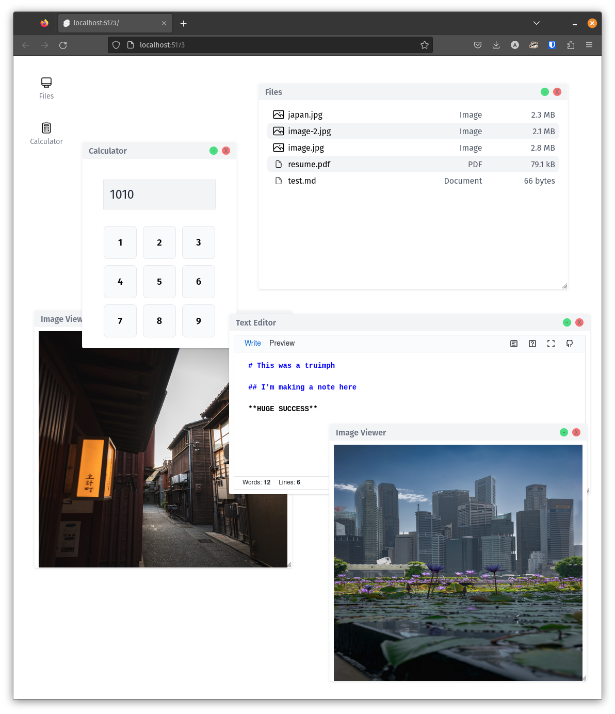

# SvOS

A browser-based desktop environment, complete with window manager, file system and an application suite.

## Running

1. Clone this project
2. `npm install`
3. `npm run dev -- --open`

## History

This project is being created as a new portfolio website for myself, but I can see it evolving into something else.

## Contributing

Feel free to submit PRs with new applications or file handlers!

### Architecture

This project was built using Svelte Kit as the base, along with TailwindCSS for styling.

SvOS consists of a few main pieces:

1. Window Manager: Handles creating, destroying and positioning windows. The backbone of the visual piece of the project.
2. Launcher: The desktop launcher, displays application icons and puts launch messages on the session bus.
3. Session Bus: A shared piece of state used for communication between pieces. The primary use case is as a "launch queue", allowing other components to instruct Window Manager to create a new window.
4. File System: Currently the file system uses the `fs` folder in the public, `static` directory. The fs code loads this directory as a blob and executes file system commands based on that blob. Only read is supported at the moment.

### Status

This project is in a proof of concept state, and is subject to major architectural changes!

**Upcoming**

- [ ] Folder support for file system and FileManager Application
- [ ] UX enhancements for Window Manager (loading states, better z-index management)
- [ ] Taskbar feature for Launcher
- [ ] First pass of Settings application (Launcher background)
- [ ] Unified Application Design System (UADS?) to provide UI components for applications (ie. GTK)
- [ ] Improvements to core applications (Calculator, Text Editor, Image Viewer)
